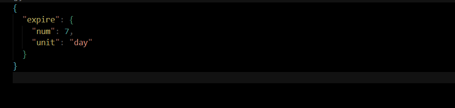

# 基于 node 的 Halo 自动备份

## 基本设置

创建一个.env 文件，里面需要包含以下字段

```
TOKEN // Halo的个人令牌，需要包含备份权限
BASE_URL // 你的域名
```

然后可以在 setting.json 里面设置一些基本信息。目前只支持过期时间的设置。格式和 Day.js 的设置相同。参考[DAY.js 官网](https://day.js.org/docs/zh-CN/manipulate/add#%E6%94%AF%E6%8C%81%E7%9A%84%E5%8D%95%E4%BD%8D%E5%88%97%E8%A1%A8)


