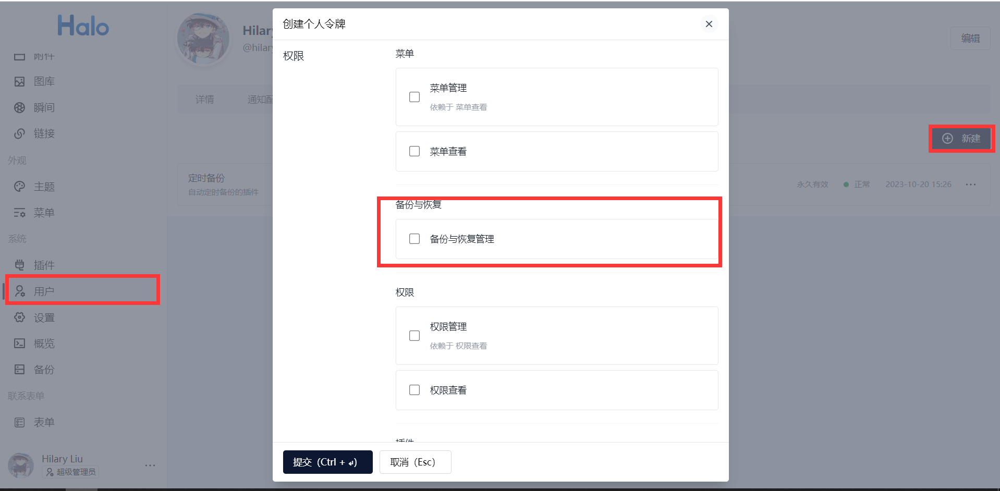

# 基于 node 的 Halo 自动备份

## 基本设置

创建一个.env 文件，里面需要包含以下字段

```
TOKEN // Halo的个人令牌，需要包含备份权限
BASE_URL // 你的域名
```

## 使用

1. 申请 Halo 的个人令牌，并且需要备份权限，获得 token 之后复制到项目的.env 文件下，key 值为 TOKEN
   

2. 修改.env 文件，将自己的域名写在该文件夹下，对应的 key 值为 BASE_URL

3. 使用 pm2 运行 src/index.js 文件，它会自动开启一个 schedule，并且在凌晨 30 自动进行备份。

## setting.json

配置文件，使用 json 格式，目前支持以下字段

```
{
  "expire": {  // 过期时间配置，和day.js配置相同，参考 https://day.js.org/docs/zh-CN/manipulate/add#%E6%94%AF%E6%8C%81%E7%9A%84%E5%8D%95%E4%BD%8D%E5%88%97%E8%A1%A8
    "num": 7,  // 数字
    "unit": "day" // 单位
  },
  "success_on_save": 5,  // 成功次数的最大保存个数
  "failed_on_save": 5   // 失败次数的最大保存个数
}
```

## TODO

- [ ]失败记录保留份数：失败备份记录的保留份数，较旧的记录会被自动删除。
- [ ]成功记录保留份数：成功备份记录的保留份数，较旧的记录会被自动删除。
- [x]基于附件存储策略，自动同步备份至远端存储。
